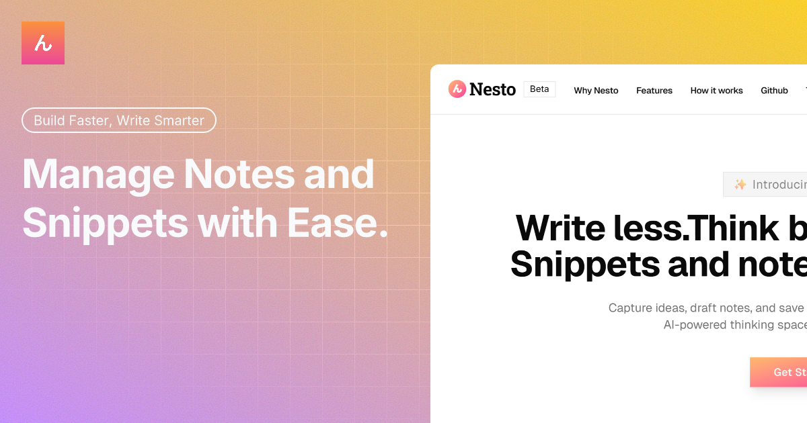

<!-- Header / Logo -->
<p align="center">
  
</p>

<h1 align="center">📚 Nesto: Your Code, Your Thoughts, Your AI</h1>

<p align="center">
  A unified space to capture code, write notes, and harness AI — designed for modern developers who move fast.
</p>

<p align="center">
  <a href="https://nestoai.vercel.app">🌐 Live Demo</a> •
  <a href="#mvp-1-highlights">✨ Features</a> •
  <a href="#roadmap-v1-➜-v2">🗺 Roadmap</a> •
  <a href="#tech-stack">🛠 Tech Stack</a>
</p>

---

## 🔥 MVP 1 Highlights

| Feature                | Description                                                                                                     |
| ---------------------- | --------------------------------------------------------------------------------------------------------------- |
| **Dashboard**          | Visualize your snippet & note activity, tag usage, and productivity trends.                                     |
| **Ask AI**             | Get help with explaining, debugging, converting, or generating code snippets using OpenAI.                      |
| **Smart Notes**        | Create rich notes with titles, content, and tags(soon!). RIch text editor with full mobile and desktop support. |
| **Code Snippets**      | Save and manage code snippets with tags across languages.                                                       |
| **Search & Tags**      | Filter by title or tags. Understand your code library better.                                                   |
| **GitHub Import**      | Import public gists directly into your snippet manager.                                                         |
| **Responsive Layouts** | Optimized UI for desktop, tablet, and mobile (with dedicated mobile routes).                                    |

---

## 🧠 AI-Powered Assistance

Use the `Ask AI` panel to:

- 🧩 Explain complex code
- 🧪 Debug broken logic
- ⚙️ Optimize code performance
- 🌐 Translate between languages (e.g., JS → Go)

---

## 🗺 Roadmap (v1 ➜ v2)

> Here's what's done ✅ and what's cooking 🍳 for the next big release:

| Status | Feature                              | Description                                                               |
| ------ | ------------------------------------ | ------------------------------------------------------------------------- |
| ✅     | **Mobile-specific Editor UX**        | Seamless full-screen note/snippet editing experience on mobile.           |
| ✅     | **GitHub Gist Import**               | Import your public gists and turn them into editable snippets.            |
| ✅     | **AI Code Explanation & Generation** | Ask AI to explain, convert, or generate code within the editor.           |
| 🔜     | **Save AI-generated Snippets**       | Directly save AI-created snippets into your personal library.             |
| 🔜     | **Multi-language UI**                | Switch between 🇬🇧 English and 🇯🇵 Japanese effortlessly.                   |
| 🔜     | **Export as OpenGraph Image**        | Create and share beautifully styled previews of your notes/snippets.      |
| 🔜     | **Folder/Workspace System**          | Organize notes and snippets into folders or project workspaces.           |
| 🔜     | **Public Sharing via Link**          | Share individual snippets or notes with a public URL — no login required. |
| 🧪     | **Realtime Collaboration**           | Work together on notes and snippets — live and in sync. _(WIP)_           |

---

## 🛠 Tech Stack

<p align="left">
  
</p>

- **Framework:** Next.js App Router
- **State Management:** Zustand(for snippets only)
- **Styling:** TailwindCSS
- **Database:** PostgreSQL (hosted via Prisma Data Platform)
- **Auth:** Clerk
- **AI:** OpenAI API
- **Code Editor:** CodeMirror
- **Analytics & Stats:** Recharts

---

## 📁 Project Structure

```
nesto/
├── app/                # Next.js App Router
│   ├── (app)
│     ├── ask-ai/           # ask-ai page
│     ├── changelog/        # changelog page
│     ├── contact/          # contact page
│     ├── dashboard/        # dashboard page
│     ├── import/           # import page
│     ├── notes/            # notes page
│     ├── privacy-policy/   # privacy policy page
│     ├── report/           # report page
│     ├── snippets/         # snippet page
│     ├── terms/            # terms page
│     ├── layout.tsx        # (app) layout
│   ├── (auth)              # auth
│     ├── sign-in/          # sign-in page
│     ├── sign-up/          # sign-up page
│     ├── layout.tsx        # (auth) layout
│   ├── api/                # api routes
│   ├── layout.tsx          # Root layout
│   ├── page.tsx            # Home page
│   ├── components/         # reusable ui components
│   ├── hooks/              # custom hooks
│   ├── lib/                # server actions, constants, initializers
├── .gitignore
├── .prettierrc
├── styles/
├── types/
├── components.json
├── middleware.ts
├── next-end.d.ts
├── next.config.ts
├── package-lock.json
├── package.json
├── postcss.config.mjs
├── README.md
├── tsconfig.json
```

## 💡 Inspiration

This project was inspired by:

- 🧠 The need for a faster, simpler snippet + note manager
- 🪄 GitHub Gist’s limitations
- ✨ The growing power of AI in dev workflows

---

## 🤝 Contributing

Contributions are welcome!  
Feel free to open issues, suggest features, or submit pull requests.

1. **Clone the repository**

   ```bash
   git clone https://github.com/deepsoumya617/nesto.git
   cd nesto
   ```

2. **Install dependencies**

   ```bash
   npm install
   ```

3. **Set up environment variables**

   ```bash
   # Create environment file in root directory
   cp .env.example .env

   # Note: Set your Clerk, Database, and OpenAI credentials inside the .env file. You can find the required fields in .env.example.
   ```

4. **Set up the database**

   ```bash
   # Generate Prisma client
   npx prisma generate

   # Run database migrations
   npx prisma migrate dev
   ```

5. **See database tables**

```bash
# Open Prisma Studio(optional)
npx prisma studio
```

5. **Start development server**
   ```bash
   npm run dev
   ```

## Star History

<a href="https://www.star-history.com/#deepsoumya617/nesto&Date">
 <picture>
   <source media="(prefers-color-scheme: dark)" srcset="https://api.star-history.com/svg?repos=deepsoumya617/nesto&type=Date&theme=dark" />
   <source media="(prefers-color-scheme: light)" srcset="https://api.star-history.com/svg?repos=deepsoumya617/nesto&type=Date" />
   
 </picture>
</a>
